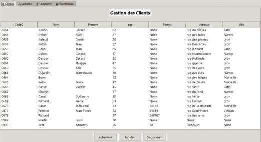
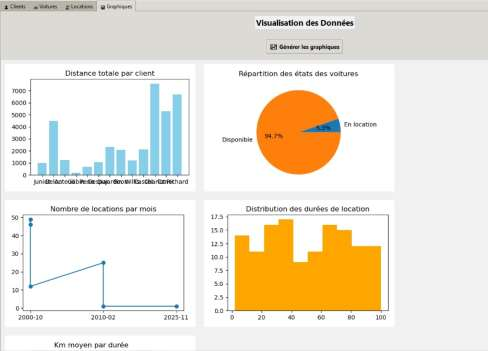

# Base de données d'une agence de location de voitures (SQL)

Projet SQL fait en binôme avec Edouard Menut à l'ECE Paris. On part de fichiers CSV (clients, propriétaires, voitures, locations) importés dans MySQL, et on construit une base propre et sécurisée, avec de la logique métier en procédures stockées et triggers. Une application Python permet ensuite de la manipuler et d'en tirer quelques graphiques.

Rapport complet : [rapport.pdf](rapport.pdf)

## Scripts

Les scripts sont dans `sql/`, à lancer dans l'ordre :

| Fichier | Contenu |
|---|---|
| [01_nettoyage_donnees.sql](sql/01_nettoyage_donnees.sql) | Typage des dates, dates de fin incohérentes, clé primaire, doublons d'emails |
| [02_contraintes_integrite.sql](sql/02_contraintes_integrite.sql) | Clés étrangères (`ON UPDATE CASCADE`, `ON DELETE SET NULL`) et contraintes `CHECK` (places, prix, année, format d'email) |
| [03_vues.sql](sql/03_vues.sql) | `V_client` (distance totale par client) et `V_Client55` ; test de modification à travers une vue |
| [04_droits_acces.sql](sql/04_droits_acces.sql) | Table applicative des accès, utilisateurs MySQL lecture / éditeur / admin avec `GRANT` |
| [05_acces_concurrents/](sql/05_acces_concurrents/) | Mise à jour perdue et correction avec `SELECT ... FOR UPDATE`, lecture sale et niveaux d'isolation (scripts à lancer dans deux sessions) |
| [06_procedures.sql](sql/06_procedures.sql) | `attribuer_notes()`, `attribuer_avis()`, `analyse_client(CodeC)` |
| [07_triggers_etat_voiture.sql](sql/07_triggers_etat_voiture.sql) | État des voitures géré automatiquement (refus de louer une voiture indisponible, retour à « Disponible » en fin de location) et historique des changements d'état |
| [08_requetes_graphiques.sql](sql/08_requetes_graphiques.sql) | Requêtes d'analyse utilisées pour les graphiques |

Les tables de départ ont été créées par import des CSV dans phpMyAdmin. Ces fichiers ne sont pas inclus.

## Application

Interface Python / Tkinter avec quatre onglets : clients, voitures, locations (ajout, modification, suppression) et graphiques (distance par client, état du parc, locations par mois, durées de location, kilométrage moyen selon la durée). Le code de l'application n'est pas encore dans ce dépôt.

## Limites

- Les dates de fin manquantes ont été complétées aléatoirement, ce qui était acceptable pour un exercice. Sur de vraies données, il faudrait les laisser à `NULL` ou les recalculer à partir de la date de début et de la durée.
- La table `ACCESS` utilise `MD5`, qui ne convient pas pour stocker des mots de passe. Il faudrait un algorithme fait pour ça (bcrypt, argon2), appliqué côté application.
